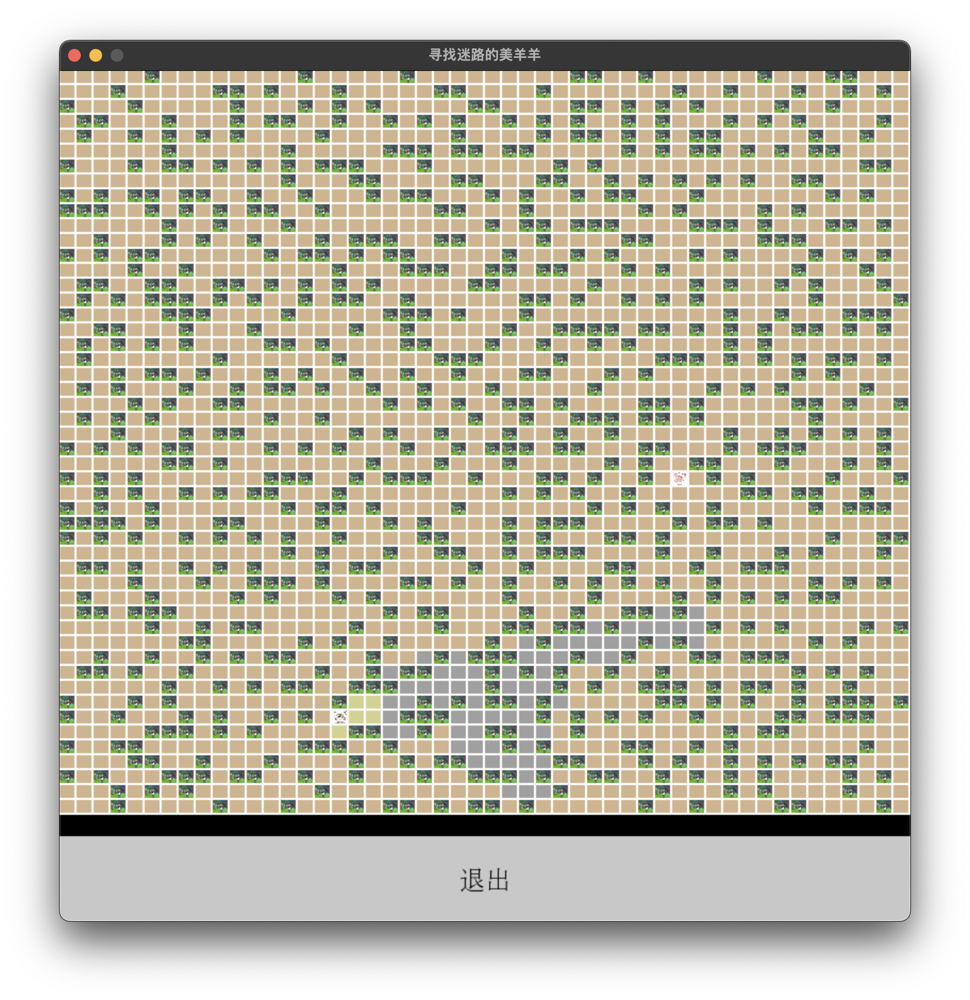
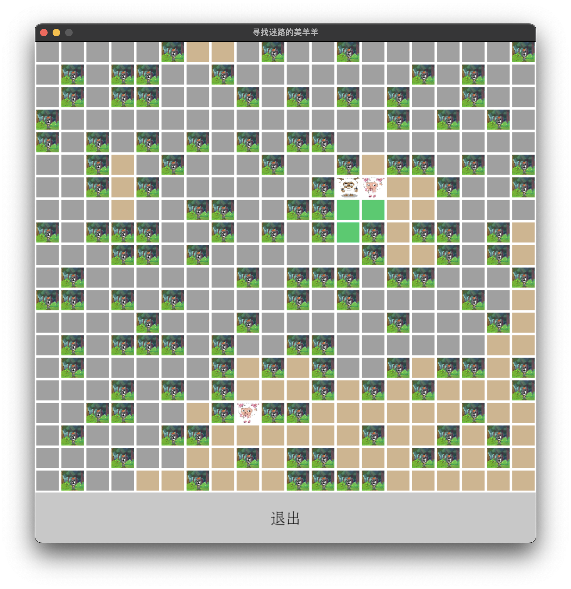

# Spacecraft Leak Detection Simulation 
Contributors: Zihao Zheng, Chongen Zheng, Yiming Huang

Other names：舔羊阿沸寻找迷路的美羊羊

<!--  -->
<!--  -->
## Project Images

  
Bot1 in a 50*50 sized ship

  

  
Bot2 in a 20*20 sized ship

  

## Introduction

Spacecraft Leak Detection Simulation project is designed to showcase a deep understanding of both deterministic and probabilistic algorithms, sensor data analysis, and the application of computer science principles to real-world problems.

## Project Overview

The simulation is set in the deep space vessel Archaeopteryx, with the primary objective being the detection and plugging of leaks within a 50x50 ship layout. The project is divided into three main parts:

1. **Deterministic Leak Detectors**: Utilizes boolean detection to sense leaks within a specified vicinity, employing algorithms that enable a bot to mark potential leak cells based on proximity detections. Bots include bot1 and bot2. 

2. **Probabilistic Leak Detectors**: Introduces a probabilistic approach to leak detection, where the likelihood of detecting a leak increases as the bot moves closer to its source. This part emphasizes the importance of sensor accuracy and algorithmic efficiency in uncertain environments. Bots include bot3 and bot4.

3. **Multiple Leaks**: Expands the simulation's complexity by introducing multiple leaks within the spacecraft, requiring enhanced strategies for detection and resolution without compromising the mission's safety. Bots include bot5, bot6, bot7, bot8, bot9.

All bots are AI integrated, meaning it will make unique decisions based on the given information in the enviroment.

## Features

- **Simulated Bots**: Each bot, with a unique detection mechanism, navigates the spacecraft to locate and plug leaks. The project explores various bot designs, including custom algorithms tailored to improve detection efficiency.
- **Algorithmic Analysis**: Detailed examination of deterministic and probabilistic algorithms, showcasing how different strategies can significantly impact the speed and accuracy of leak detection.
- **Performance Metrics**: Evaluation of bots based on the average number of actions (moves and sensing) needed to successfully plug leaks, providing insights into the effectiveness of each algorithm and bot design.
- **Scenario Complexity**: From single to multiple leaks, the simulation presents escalating challenges that test the bots' adaptability and problem-solving skills.
- **Rich GUI Functionalities**: All bots are simulated using PyGame GUI and brings background music for entertainment. In addition, the user could stop the simulation at anytime using the exit button on the bottom.

## Outstanding bots

### Bot1 in detail
 At every timestep, the bot can detect whether there is a leak in the vicinity of the bot (a boolean yes/no detection). For a given k ≥ 1, the bot sits at the center of a (2k + 1) × (2k + 1) square, and can detect whether or not a leak is present in that square. The bot can detect if it enters the square with the leak.
The bot is initially placed randomly and the leak is initially placed in a random cell outside the detection square. When the bot enters a cell (or starts in a cell), however, if it is not the leak cell, it is marked as not containing the leak. If the bot detects no leak in proximity - all cells in the detection square are marked as not containing the leak. If the bot detects a leak in proximity - all cells in the detection square not already marked as not containing the leak are marked as possibly containing the leak, and all cells outside the detection square are marked as not containing the leak. Note that if a single square remains that is marked as containing the leak and all others do not contain the leak - the leak must be in that one marked cell. Bot 1 acts in the following way:

- At any time that has not detected a leak, it will proceed to the nearest cell that might contain the leak (breaking ties at random), enter it, and take the sense action, updating what it knows based on the results.
  
- At any time that a leak has been detected, it will proceed to the nearest cell that might contain the leak, enter it, and in doing so either find the leak or rule that cell out.
  
This proceeds until the leak is discovered.

### Bot3 in detail
In this case, the detection is probabilistic - the bot has a sensor that, when activated, has a probability of giving a beep if the leak is nearby. The nearer the bot is to the leak, the more likely it is to receive a beep. Note that if the bot stays in place, it may receive a beep at some timesteps, and not at others (with the correct probability). If the bot is d-steps away from the leak (shortest path through the ship), the probability of receiving a beep is e^(−α(d−1)), for α > 0. Note that if the bot is immediately next to the leak, the probability of receiving a beep is 1.
All cells (other than the bot’s initial cell) start with equal probability of containing the leak. Bot 3 proceeds in the following well:

- At any time, the bot is going to move to the cell that has the highest probability of containing the leak (breaking ties first by distance from the bot, then at random).
- After entering any cell, if the cell does not contain a leak, the bot will take the sense action. Based on the results, it updates the probability of containing the leak for each cell.
- After the beliefs are updated, this repeats, the bot proceeding to the cell that as the highest probability of containing the leak (breaking ties first by distance from the bot, then at random).

### Bot5 in detail
Bot 5 is an upgraded version of Bot 1, where it removes the first leak once its cell is entered, and continues until the second leak is also identified and plugged.

### Bot 7 in detail
Bot 7 is an upgraded version Bot 3, where it removes the first leak once its cell is entered, and then continues searching and updating until the second leak is identified and plugged.

### Bot 8 in detail
Bot 8 is an upgraded version of Bot 7, where the calculation of probability is scaled to make better decisions.

### Bot 9 in detail
In the eyes of Bot 9, the ship is made up of 4 sections
At any time, the bot is going to move to the cell that is in the "highest beep section" (if all sections are equal then at random) that has the highest probability of containing the leak (breaking ties first by distance from the bot, then at random).
After entering any cell, if the cell does not contain a leak, the bot will take the sense action. Based on the results, it updates the probability of containing the leak for each cell.
If the bot hears a beep, then the probability will be updated again

## GUI Representation of Bot, Leak, and plugging of leak
To make the GUI have more entertainment, we use the cartoon figures from the most famous Chinese Cartoon 'Pleasant Goat and Big Big Wolf' released in 2005, to represent the bot and the leak, bringing back memories. 

  
Image of bot in the GUI

  

  
Image representation of the leak in the GUI

  

  
Bot finds and plugs the leak

  

背景故事：美羊羊在森林中迷路了，随时可能遇到灰太狼！舔狗沸羊羊立刻出发寻找迷路的美羊羊！
